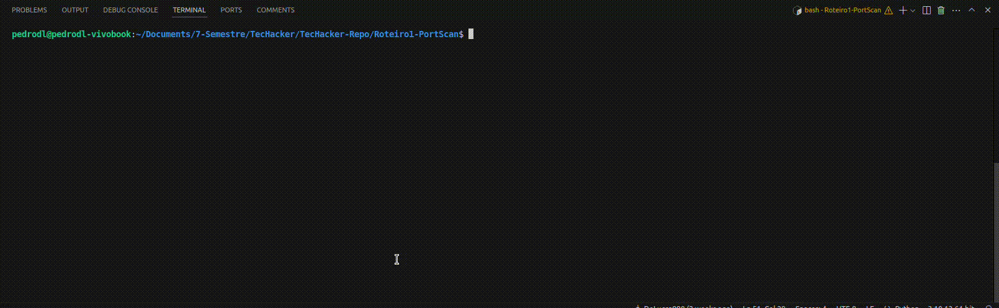

# Port Scanner
## Descrição
PDL Port Scanner é uma ferramenta desenvolvida em Python para a varredura de portas em hosts individuais ou redes inteiras. Suportando os protocolos TCP e UDP e incluindo funcionalidades como banner grabbing para tentar identificar serviços e possíveis informações sobre o sistema operacional.

## Funcionalidades
- Varredura de portas TCP e UDP
- Banner grabbing
- Identificação de sistema operacional
- Suporte a IPv4 e IPv6
- Suporte a múltiplos hosts
- Geração de relatórios

## Estrutura
```
├── main.py # Script principal
├── utils # Módulo com funções utilitárias
│   ├── utils.py
│   └── dict_ports.py
├── reports # Diretório com relatórios gerados
├── requirements.txt # Arquivo com as dependências do projeto
└── README.md
```

## Instalação
1. Clone o repositório
    ```bash
    git clone https://github.com/DeLucca990/TecHacker.git # HTTPS
    ou
    git clone git@github.com:DeLucca990/TecHacker.git # SSH
    ```
2. Instale as dependências
    ```bash
    pip install -r requirements.txt
    ```

## Utilização
1. Rodar o script principal
    ```bash
    python3 main.py # Linux
    ou
    python main.py # Windows
    ```
2. Campos de entrada
    - **Modo de Varredura**: Host único ou rede
    - **Protocolo**: TCP ou UDP
    - **Range de Portas**: Weel-known ou Todas
    - **Porta Inicial**: Porta inicial da varredura
    - **Porta Final**: Porta final da varredura
    - **Host(s) ou Rede**: Host(s) ou rede a serem varridos (de acordo com o modo de varredura)
    - **Relatório**: Ao final da varredura, você pode escolher gerar um relatório com os resultados

## Demonstração


## Contribuições
Se você encontrar bugs ou tiver sugestões de melhoria, sinta-se à vontade para abrir uma _issue_ ou enviar um _pull request_.